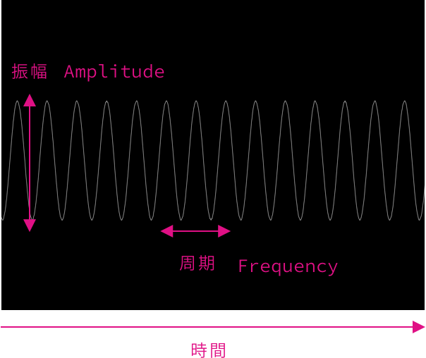
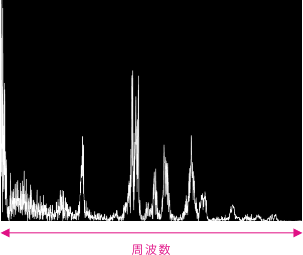
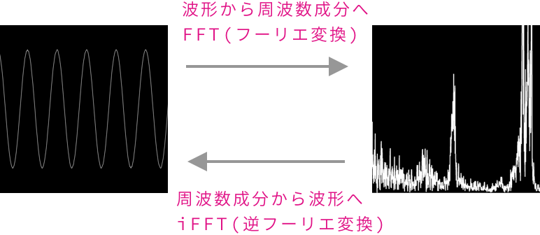

# FFT

---

## フーリエ変換

19世紀フランスの数学者・物理学者のジョゼフ・フーリエに由来する周波数変換

[フーリエ変換を宇宙一わかりやすく解説してみる](https://www.yukisako.xyz/entry/fourier-transform?fbclid=IwAR2LO11wfY1mKQqiqESLoO3kYPoBwLT9c-Bqx-2CQQJRDZxizw-NLNw_JGs)

&nbsp;
&nbsp;

## FFTによる音の周波数解析

### 音の波形

&nbsp;
&nbsp;

### 周波数解析

&nbsp;
&nbsp;

### FFTによる周波数

&nbsp;
&nbsp;

