# CHOP (Channel Operator)

数値処理を行うオペレータ

---


&nbsp;
&nbsp;

## 公式リファレンス
[CHOP - Channel Operators](https://docs.derivative.ca/CHOP)

---

&nbsp;
&nbsp;

# OP

&nbsp;
&nbsp;


## Audio Device In
音の入力

&nbsp;
&nbsp;

## Audio Device Out

音の出力

&nbsp;
&nbsp;

## Audio Oscllator

音響合成

&nbsp;
&nbsp;

## Audio Spectrum

FFT周波数分析をする

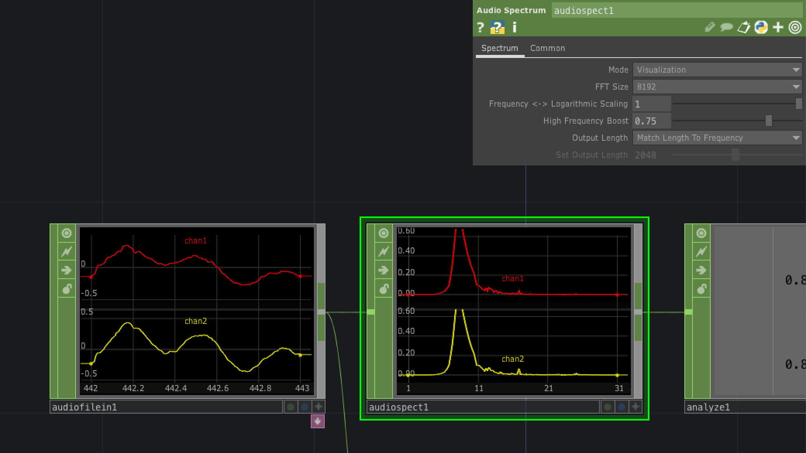

* `FFT Size` スペクトラム解析に使うサンプル数 （べき乗で指定する）

*  `Frequency <-> Logarithmic Scaling` 音量 / 周波数の比率。1に上げると人間の聴域に近く低周波数側が表示されてくる 

* `High Frequency Boost` 1より大きい場合、高周波数のボリュームが上がる

* `Output Length` 出力方法。`Set Output Length`から`Set Length Manual`にしてサンプル数を調整する


&nbsp;
&nbsp;


## Constant

変数、数値の保存。デフォルトでは名前が「chan1」となり0-1の間で保存ができる。
スライダに直接入力すると値をあげられることができる。1つのオペレーターに40個保存することができる。

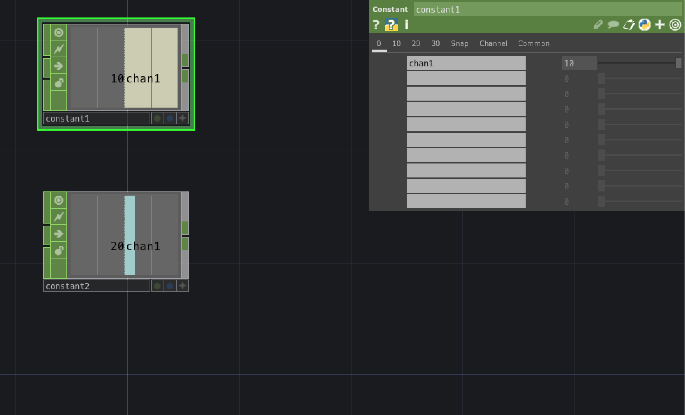

&nbsp;
&nbsp;

## Count

数値を増減していく

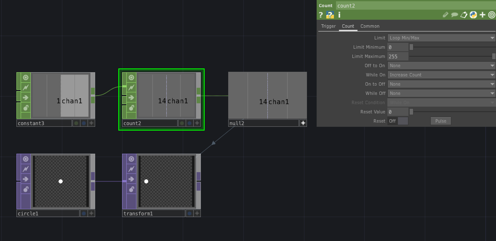

* Limit で最小値と最大値を設定

&nbsp;
&nbsp;


## DAT to

DATからCHOPへの変換

### Tableからxyzの値を移行する

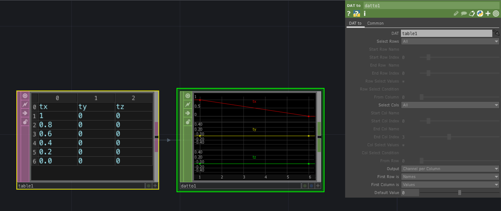

* `Output`を `Channel per Column`
* `First Row is` を `Name`
* `First Column is` を `Value`


&nbsp;
&nbsp;

## Delay

遅延

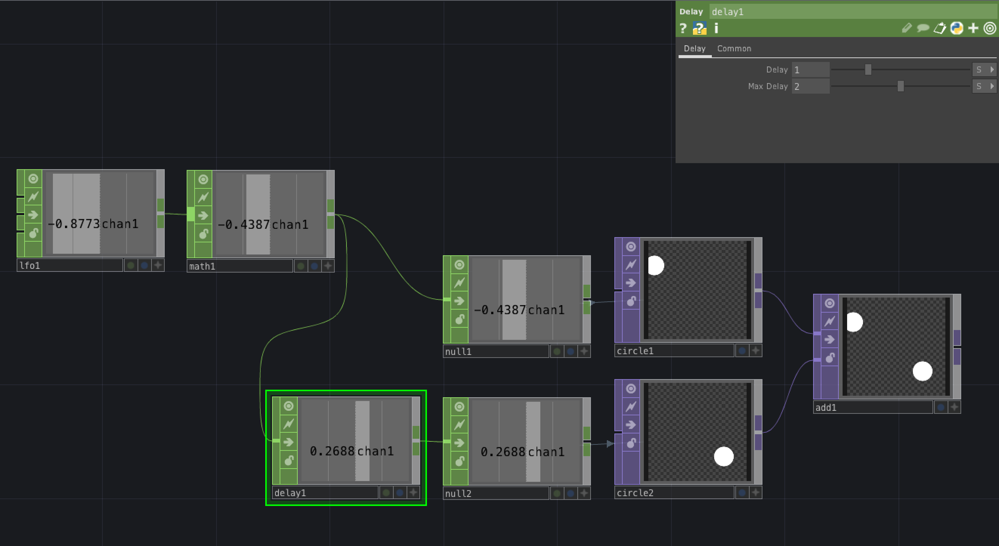

&nbsp;
&nbsp;

## Expression 

条件を分岐するオペレーター

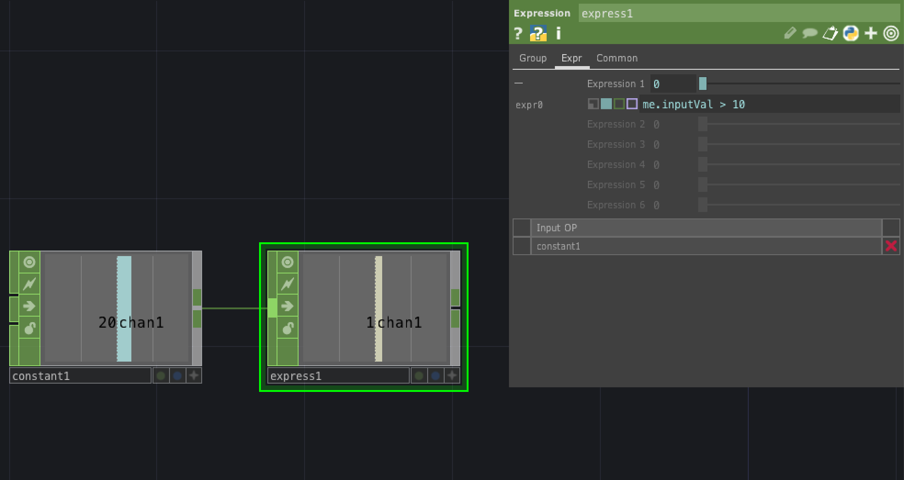

```
//10以上になったら1を返す
me.inputVal > 10

```

&nbsp;

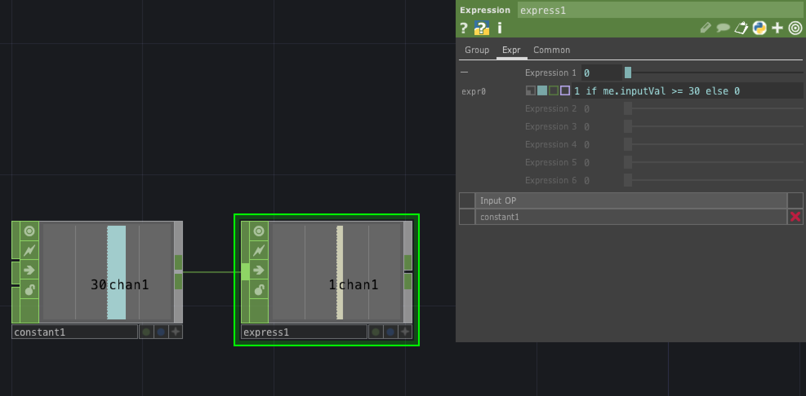

```
//30以上の場合は値が1、そうじゃない場合は0
1 if me.inputVal >= 30 else 0

```

&nbsp;
&nbsp;


## Filter

数値の変動をフィルタリングする。スムースあるいはシャープに

&nbsp;
&nbsp;

## Lag

時間を設定して数値が変動する。初速終速を調整できる。

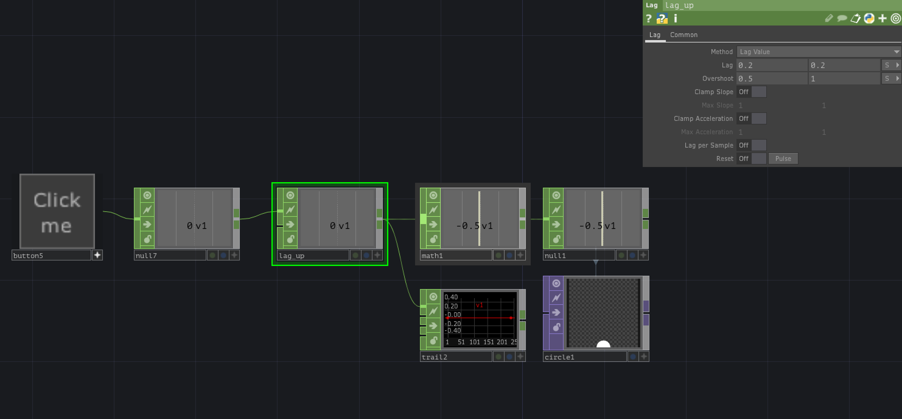

* `Lag` 経過時間。1つ目の入力は0から1への経過。2つ目の入力は1から0への経過
* `Overshoot` 通り越して戻る

&nbsp;
&nbsp;

## LFO 

周波数を生成する


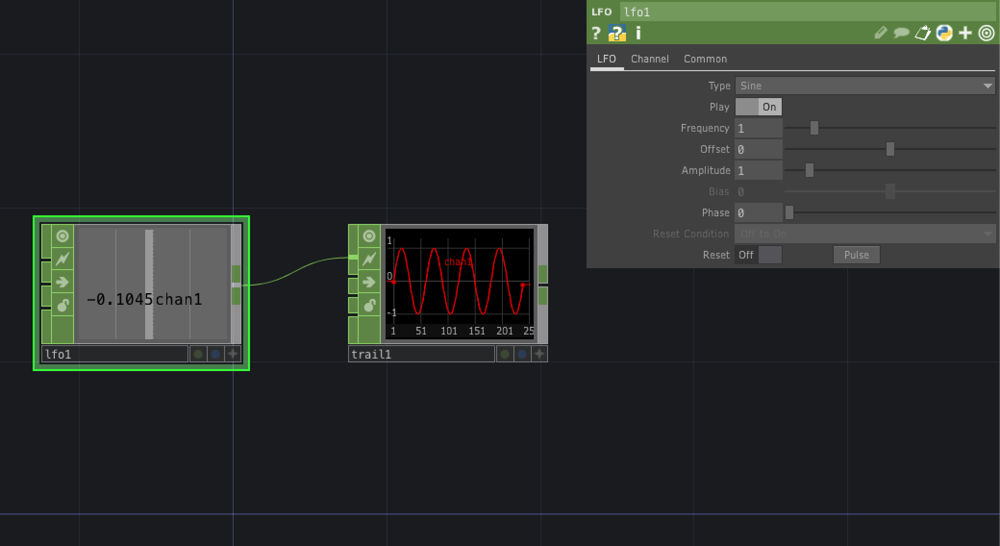

* `Type` 周波数の形

	* `Sin` サイン波 -1 から 1の繰り返し
	* `Gaussian` 0-1-0の繰り返し
	* `Triangle` 三角波　-1 から 1の繰り返し
	* `Ramp` 0-1 の繰り返し
	* `Square` 矩形波　-1 から 1の繰り返し
	* `Pulse` 点滅　-1 から 1の繰り返し

* `Frequency` 周期
* `Amplitude` 振幅


&nbsp;
&nbsp;


## Limit

入力値に最大・最小の制限をつける

&nbsp;
&nbsp;


## Logic

入力値を論理演算する


* `Convert Input`
	* `Off When Zero`	入力が0の時False、それ以外はTrue
* `Combine CHOPs`
	* `And` 論理積　いずれも 1 の場合にTrue
	* `Or` 論理和　どちらかが 1 の場合にTrue

[参考:TouchDesignerでの論理演算](https://qiita.com/joe0hara/items/82f5de39ff82873e994b)

&nbsp;
&nbsp;


## Math

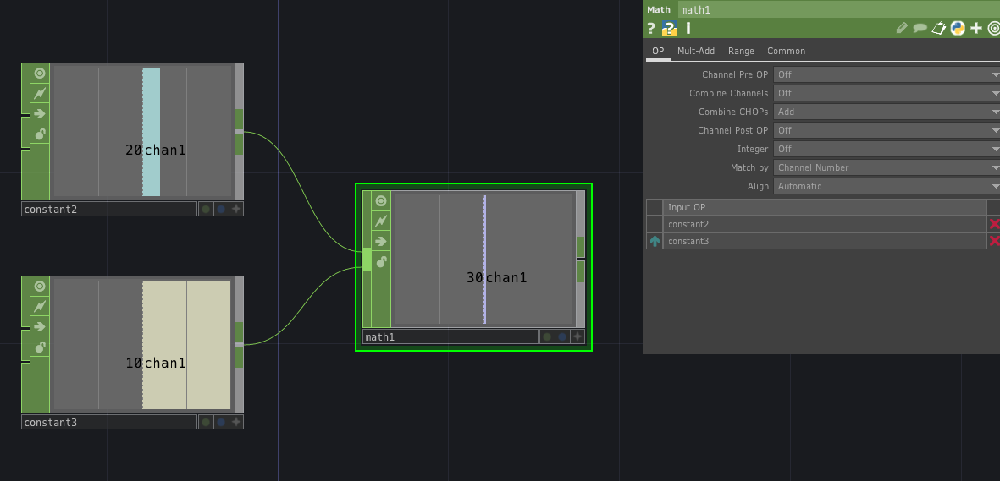

### OP
- 複数のOPをつなぎ `Combile CHOPs` から四則演算

### Mult-Add

- `Multiply`で数値を掛け算

### Range

- `From Range`の値を`To Range`にマッピングする


&nbsp;
&nbsp;

## Merge

複数のCHOPの値をひとつにまとめる

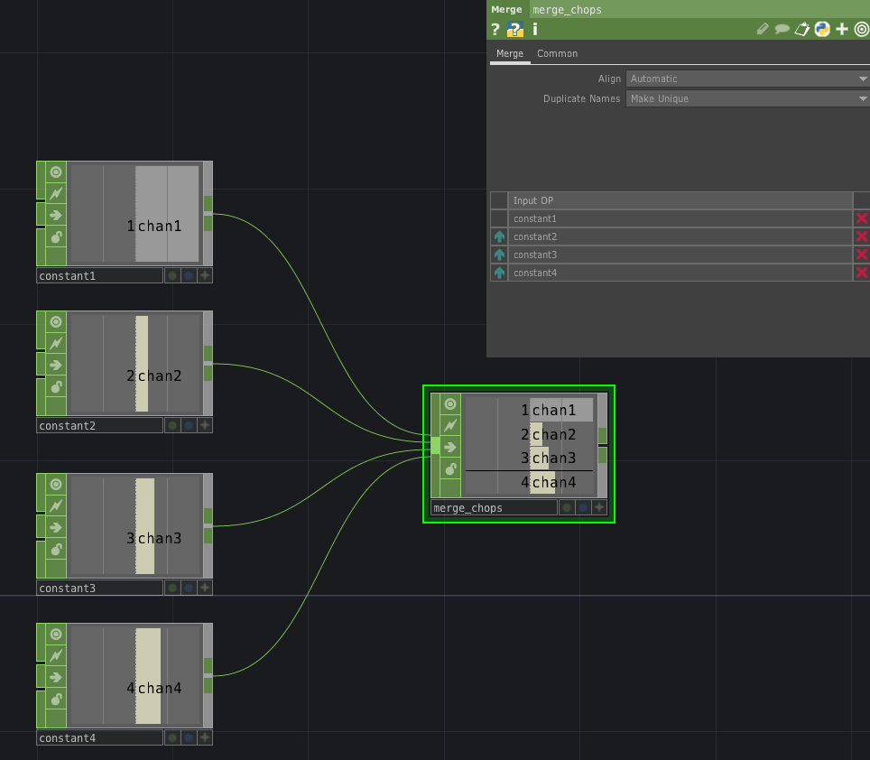


&nbsp;
&nbsp;

## Mouse In

マウス座標


&nbsp;
&nbsp;


## Noise
-1から1の間で自然な乱数を生成する。

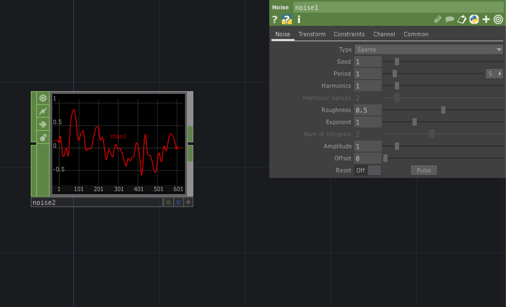

`Time Slise`を`On`にすると連続で値を返す

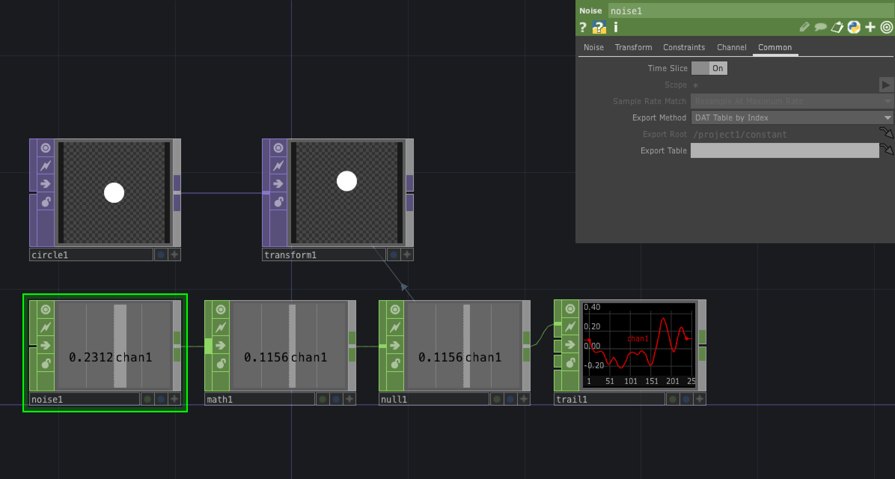


&nbsp;
&nbsp;

## Null

何もないOP、前のOPのデータを引き継ぐ。
TouchDesignerでは出力前や最後のOPをNullにする

&nbsp;
&nbsp;


## OSC In

OSC 通信

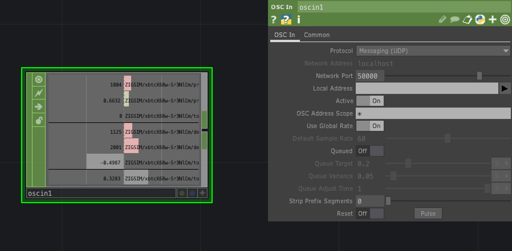


&nbsp;
&nbsp;

## Parameter

特定のOPからパラメーターを出力する

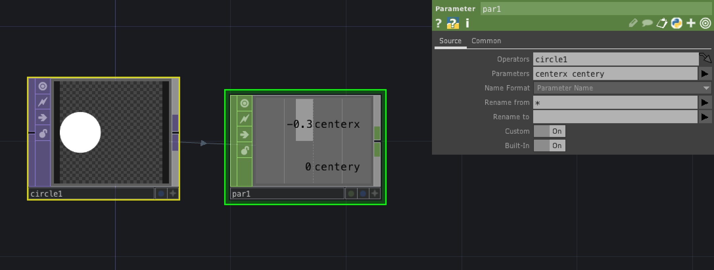

* `Operators` 任意のOPをドラッグ
* `Built-in` を `On` に
* `Parameters` で出力したいパラメータを指定

&nbsp;
&nbsp;

## Pattern

周期をつくる

&nbsp;
&nbsp;

## Perform

パフォーマンスを計測する

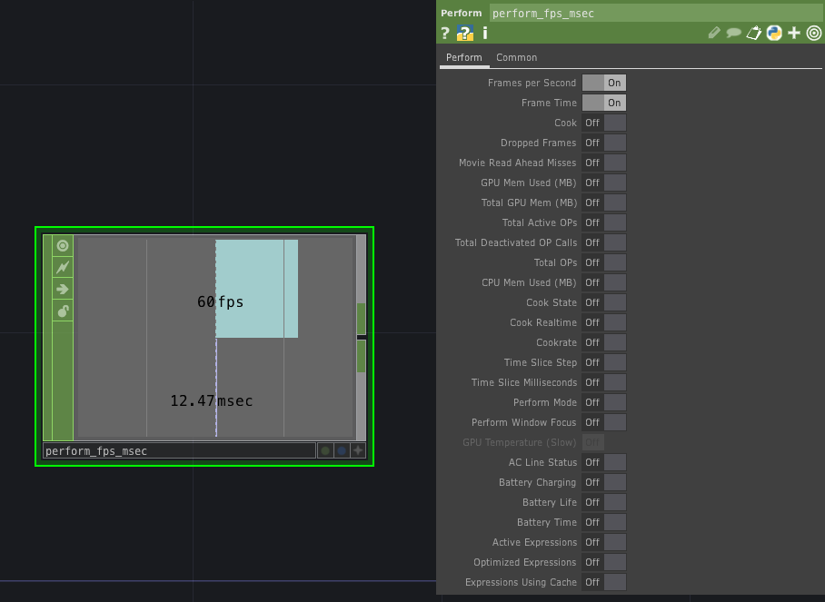

&nbsp;
&nbsp;

## Rename

チャンネル名を変える

&nbsp;
&nbsp;

## Resample

出力するサンプル数を調整する

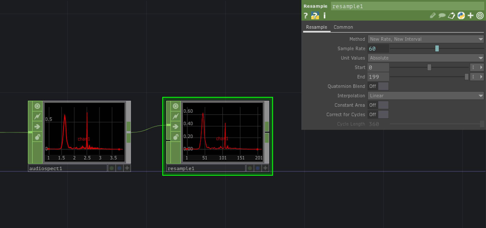

1.  `Method` `New Rate, New Interval` に変更
2. `Unit Values`を`Absolute`に変更
3. `Start`から`End`の値を変更してサンプル数を調整する。単位は `I : Sample Rate`を選択する

&nbsp;
&nbsp;


## Select

チャンネルを絞る

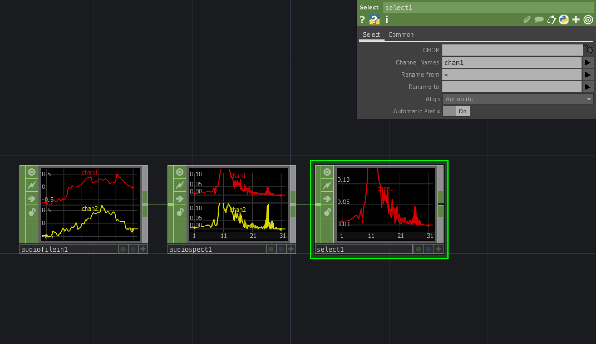

Audioから片方のチャンネルを絞る


OSCからひとつのチャンネルを絞る

&nbsp;
&nbsp;

## Shuffle

入力した値を並べ替える

&nbsp;
&nbsp;

## Speed

時間内に数値が変化する
第1入力に値が送られると毎秒1カウントづつ増加します。


&nbsp;

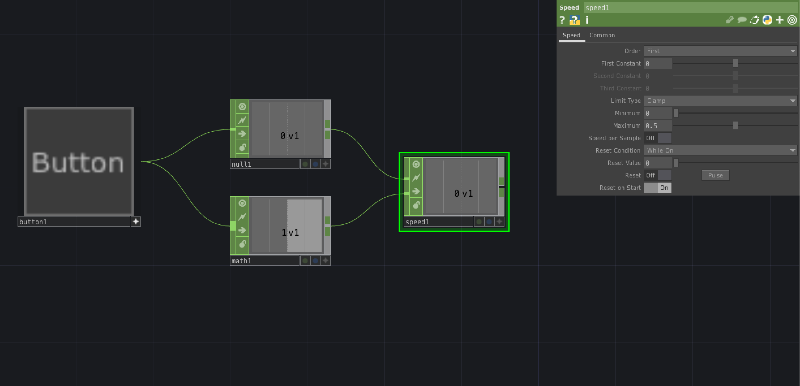

第2入力に0が送られるとリセットする


&nbsp;
&nbsp;


## Slope

入力値を微分する

&nbsp;
&nbsp;


## Trail

数値を視覚的グラフで表す

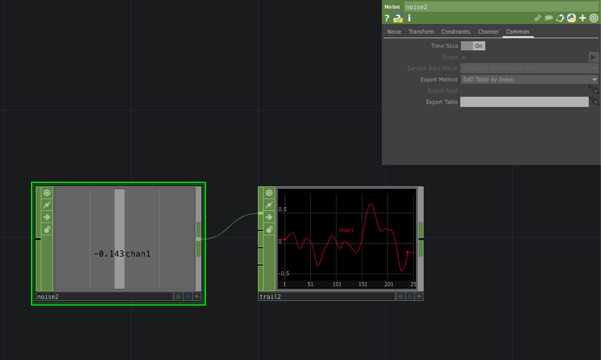


&nbsp;
&nbsp;

## Timer
タイマー

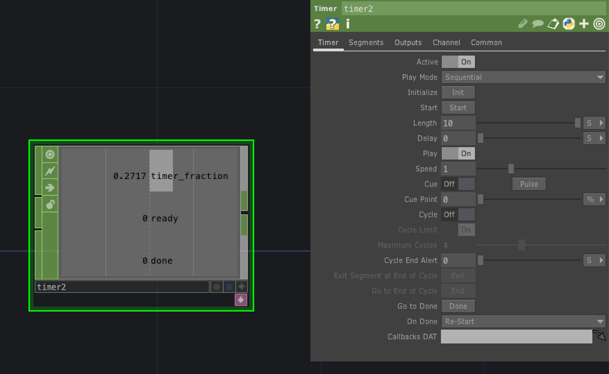

* `Initialize` 初期化
* `Start` 開始
* `Length` タイマーの長さ
* `Speed` 速さ
* `Cue`
* `Cycle` 繰り返しの回数指定
* `On Done`の項目から`Re-Start`でループし続ける


```
# タイマーイベント

def onInitialize(timerOp):
	return 0

def onReady(timerOp):
	return
	
def onStart(timerOp):
	return
	
def onTimerPulse(timerOp, segment):
	return

def whileTimerActive(timerOp, segment, cycle, fraction):
	return

def onSegmentEnter(timerOp, segment, interrupt):
	return
	
def onSegmentExit(timerOp, segment, interrupt):
	return

def onCycleStart(timerOp, segment, cycle):
	return

def onCycleEndAlert(timerOp, segment, cycle, alertSegment, alertDone, interrupt):
	return
	
def onCycle(timerOp, segment, cycle):
	return

def onDone(timerOp, segment, interrupt):
	return
	
```

&nbsp;
&nbsp;

## TimeSlice

時間変化を生成する


&nbsp;
&nbsp;


## Trigger

入力値に対して指定したしきい値`Trigger Threshold`を超えた場合1を返す
出力値にADSR(Attack/Decay/Sustain/Release)エンベロープの指定ができる。

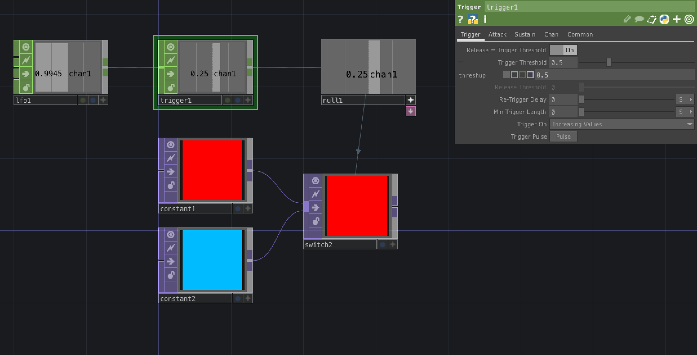

&nbsp;
&nbsp;


## Wave

周期を作る

