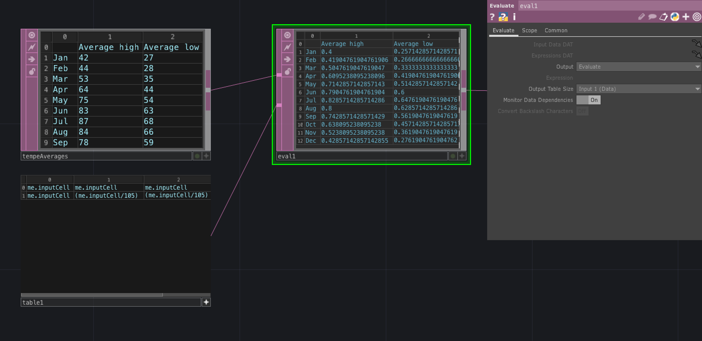
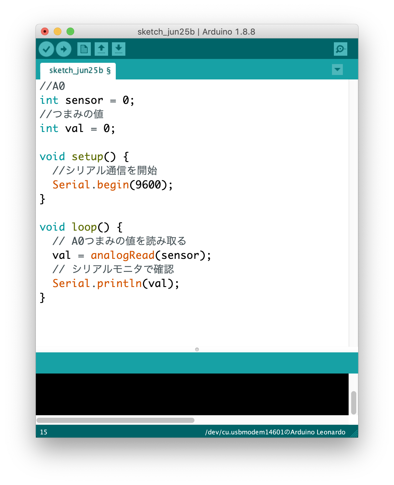
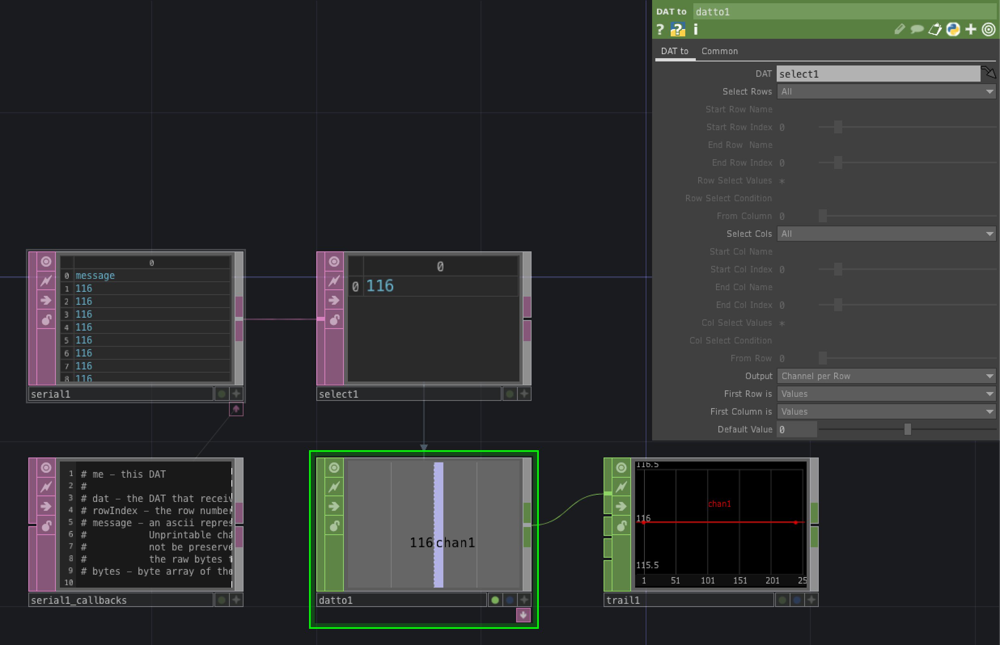
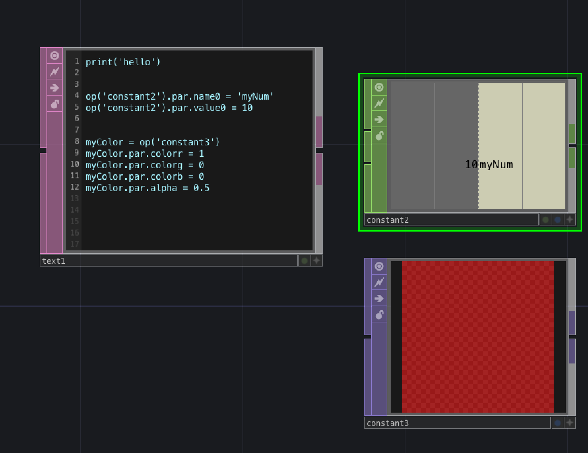

# DAT (Data)

データベースや外部デバイスとの連携を行うオペレータ

---

&nbsp;
&nbsp;

## 公式リファレンス
[DAT - Data Operators](https://docs.derivative.ca/DAT)


&nbsp;
&nbsp;

---

# OP


## CHOP Execute

CHOPの値が変化したタイミングで実行

* onOffToOn 値が0以下から0を超えたら
* whileOn 値が0を超えている間
* onOnToOff　0を超えた値から0以下になった
* whileOff　値が0以下の場合
* onValueChange　値が変化したタイミング

```


```


&nbsp;
&nbsp;

## Evaluate

DATの内容を調整する


### Tableの値を正規化




&nbsp;
&nbsp;

## Execute

フレーム毎や、ファイルを開いたタイミングなどで実行したい処理がある場合の関数

* onStart TouchDesignerの開始時
* onCreate
* onExit
* onFrameStart 毎フレーム実行される
* onFrameEnd
* onPlayStateChange
* onDeviceChange
* onProjectPreSave
* onProjectPostSave


### Pythonでインクリメントカウンタ

```

# グローバル変数
num = 0

# 毎フレーム実行
def onFrameStart(frame):
	global num # グローバル変数を呼び出す場合の宣言
	if frame % 60 == 0:
		num+=1
		# print(num)

	op('constant1').par.value0 = num
	return

```

&nbsp;
&nbsp;


## Examine

オペレータのPythonストレージ、ローカル変数、グローバル変数、エクスプレッション、エクステンションを表示する

&nbsp;
&nbsp;

## Panel Execute

パネルの変化で実行される


&nbsp;
&nbsp;


## Serial

シリアル通信


### Arduino と　TouchDesignerの連携

#### Arduino




```
//A0
int sensor = 0;
//つまみの値
int val = 0;

void setup() {
  //シリアル通信を開始
  Serial.begin(9600);
}

void loop() {
  // A0つまみの値を読み取る
  val = analogRead(sensor);
  // シリアルモニタで確認
  Serial.println(val);
}
```

&nbsp;

#### TouchDesigner

##### 1 `Port` を指定する


&nbsp;


##### 2 Select DATで1行分取得


* Select Cols：by Index
* Start Row Index：1
* End Row Index：1

&nbsp;

##### 3 DAT to CHOPで値を取得



* DAT：`select1`
* First Column is：`Values`

&nbsp;
&nbsp;


## Table
行列のテーブル


外部テキストで表組みを組む場合には`Tab`区切りでセルが生成される

&nbsp;
&nbsp;


## Text

テキストデータ。Pythonのスクリプトからopのパラメーターを操作できる。


#### Pythonスクリプトの実行

Pythonの実行は右クリックで`Run Script` 

ショートカット`Cmd` + `R`

```
print( op('constant1').par.value0 )
```


&nbsp;



```
print('hello')

op('constant2').par.name0 = 'myNum'
op('constant2').par.value0 = 10


myColor = op('constant3')
myColor.par.colorr = 1
myColor.par.colorg = 0
myColor.par.colorb = 0
myColor.par.alpha = 0.5

```

&nbsp;
&nbsp;

